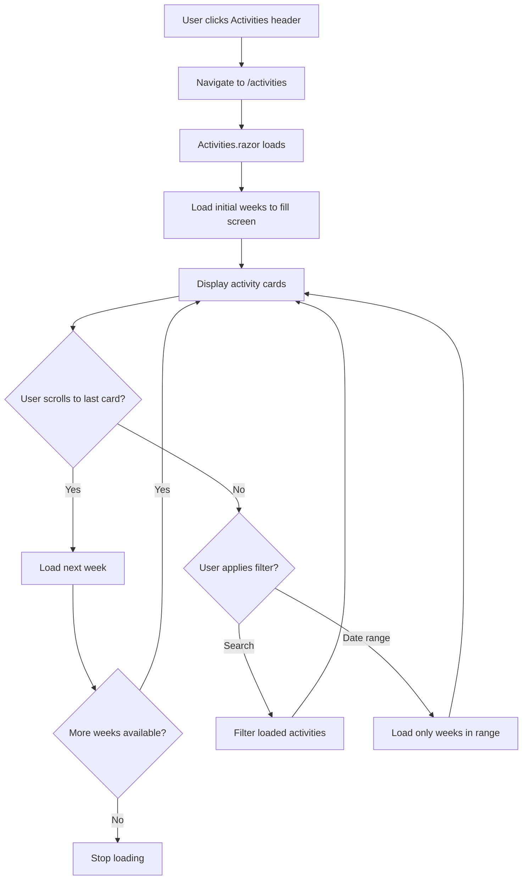

# Activity List Screen Implementation

OverviewImplement a new activity list screen that opens when clicking the "Activities" header on the main screen. The screen will feature search, date filtering, infinite scroll, and reuse the activity card design.

## Implementation Details

### 1. Create Reusable Activity Card Component

- **File**: `Trainer/Components/ActivityCard.razor`
- Extract the activity card markup from `Index.razor` (lines 71-85) into a reusable component
- Accept `Activity` and `ActivityType` list as parameters
- Include click handler to navigate to edit activity page
- Reuse the same styling and structure

### 2. Make Activities Header Clickable

- **File**: `Trainer/Pages/Index.razor`
- Modify line 44: Change `<h5 class="mb-0">Activities</h5>` to be clickable
- Add `@onclick` handler to navigate to `/activities` route
- Style as a clickable element (cursor pointer, hover effect)

### 3. Create Activity List Page

- **File**: `Trainer/Pages/Activities.razor`
- Route: `@page "/activities"`
- Features:
- Header with "Activities" title and back button (use browser history to return to previous page or `/` if no history is available)
- Search input field (filters activities by activity type name, notes, or amount)
- Date duration filter (Last 24 hours, Current Week, Last 7 days, Last 4 Weeks, All time)
- Add new activity button (navigates to `/activity`)
- Activity cards container using the `ActivityCard` component
- Infinite scroll implementation

### 4. Implement Infinite Scroll Logic

- **Initial Load**: Calculate how many weeks are needed to fill the screen (estimate 1 week based on typical activity count)
- **Week-by-Week Loading**: Load activities week by week starting from the most recent week going backwards
- **Scroll Detection**: Use JavaScript interop with IntersectionObserver to detect when the last activity card is visible
- **Load More**: When last card is visible, load the next week's activities
- **Date Filter Integration**: When date filter is active, only load weeks within the filtered date range
- **Search Integration**: Apply search filter to loaded activities (client-side filtering)

### 5. Service Method for Week-Based Loading

- **File**: `Trainer/Services/ActivityService.cs`
- Add method `GetActivitiesByWeekKeysAsync(IEnumerable<string> weekKeys)` if needed (already exists via `GetActivitiesByWeekRangeAsync`)
- The existing `GetAllAsync(DateTime? startDate, DateTime? endDate)` can be used for date-filtered loading

### 6. JavaScript Helper for Intersection Observer

- **File**: `Trainer/wwwroot/js/infinite-scroll.js` (new file)
- Create IntersectionObserver helper for detecting when last element is visible
- Register in `index.html`

## Data Flow

## Key Implementation Points

1. **Week Loading Strategy**: Start from current week, load backwards week by week
2. **Screen Fill Calculation**: Estimate ~20-30 activities per week, load 2 weeks initially
3. **Intersection Observer**: Use JSInterop to detect when last card enters viewport
4. **State Management**: Track loaded week keys, current filter state, search term
5. **Performance**: Only load weeks as needed, filter client-side for search

## Files to Create/Modify

- **New Files**:
- `Trainer/Components/ActivityCard.razor`
- `Trainer/Pages/Activities.razor`
- `Trainer/wwwroot/js/infinite-scroll.js`