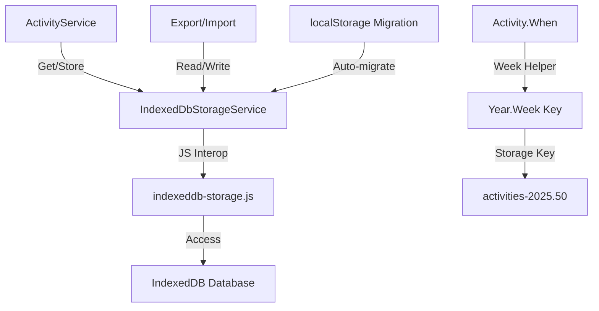

# Weekly Activity Storage Implementation

## Overview

Transform activity storage from a single localStorage key to IndexedDB with weekly partitioning. Activities will be stored using keys like `activities-2025.50` where the format is `year.week` (ISO 8601 week numbering). This enables batched loading and better performance for large datasets.

## Implementation Plan

### 1. Create IndexedDB Storage Service

Create a new `IndexedDbStorageService` implementing `IStorageService` that:

- Opens/creates an IndexedDB database named "Trainer"
- Stores activities using weekly keys (`activities-{year}.{week}`)
- Provides methods for batch operations (get all weeks, get by week range)
- Migrates existing localStorage data on first initialization

**Files to create:**

- `Trainer/Services/IndexedDbStorageService.cs` - Main service implementation
- `Trainer/wwwroot/js/indexeddb-storage.js` - JavaScript interop for IndexedDB operations

### 2. Add Week Helper Utilities

Create utility methods for:

- Converting `DateTime` to ISO 8601 week number format (`YYYY.WW`)
- Parsing week keys back to date ranges
- Getting week ranges from date ranges

**Files to create:**

- `Trainer/Services/WeekHelper.cs` - Static helper class for week calculations

### 3. Update ActivityService

Modify `ActivityService` to:

- Support week-based storage
- Change `GetAllAsync()` to accept optional `startWeek` and `endWeek` parameters (or load all if not specified)
- Store activities in the correct week bucket based on `activity.When`
- Handle updates/deletes that may move activities between weeks
- Load activities from multiple week buckets when needed

**Files to modify:**

- `Trainer/Services/ActivityService.cs`
- `Trainer/Services/IActivityService.cs`

### 4. Update Export/Import Service

Modify `ExportImportService` to:

- Export activities in the new format: `{ "activities": { "2025.50": [...], "2026.1": [...] }, ... }`
- Import activities from both old format (array) and new format (weekly object)
- Support backward compatibility during transition

**Files to modify:**

- `Trainer/Services/ExportImportService.cs`

### 5. Update UI Components

Update call sites to pass week range parameters or load all data:

- `Index.razor` - Load all activities (may need pagination later)
- `ActivityEntry.razor` - Only needs specific activity, can load by ID

**Files to modify:**

- `Trainer/Pages/Index.razor`
- `Trainer/Pages/ActivityEntry.razor` (if needed)

### 6. Data Migration

Implement automatic migration:

- On first load, check for localStorage data
- If found, migrate all activities to IndexedDB weekly buckets
- Clear localStorage after successful migration
- Handle migration errors gracefully

**Files to modify:**

- `IndexedDbStorageService.cs` - Add migration logic in constructor/initialization

### 7. Update Program.cs

Register `IndexedDbStorageService` instead of `LocalStorageService` for activities (or make it the default for all storage).**Files to modify:**

- `Trainer/Program.cs`

### 8. Update Tests

Update unit tests to work with new storage interface and weekly storage format.**Files to modify:**

- `Trainer.Tests/Services/ActivityServiceTests.cs`
- `Trainer.Tests/Services/ExportImportServiceTests.cs`

## Key Implementation Details

### Week Number Format

- Use ISO 8601 week numbering: `YYYY.WW` (e.g., "2025.50", "2026.1")
- Week 1 is the first week with a Thursday (ISO standard)
- Use C#'s `Calendar.GetWeekOfYear()` with appropriate calendar rules

### IndexedDB Schema

```javascript
Database: Trainer
  Object Store: activities
    Key: activities-{year}.{week} (string)
    Value: Array of Activity objects (JSON)
```


### Storage Key Pattern

- Weekly keys: `activities-2025.50`, `activities-2026.1`
- Use prefix `activities-` followed by `year.week` format
- Activities are stored in the week they were created (based on `activity.When`)

### Batched Loading

- `GetAllAsync()` can load all weeks or accept optional date range
- Activities loaded from multiple week buckets are merged and sorted
- Support for loading specific week ranges to enable pagination/filtering

## Data Flow




## Migration Strategy

1. Check for localStorage key "activities" on IndexedDB init
2. If found, load all activities from localStorage
3. Group activities by week using WeekHelper
4. Store each week's activities in IndexedDB