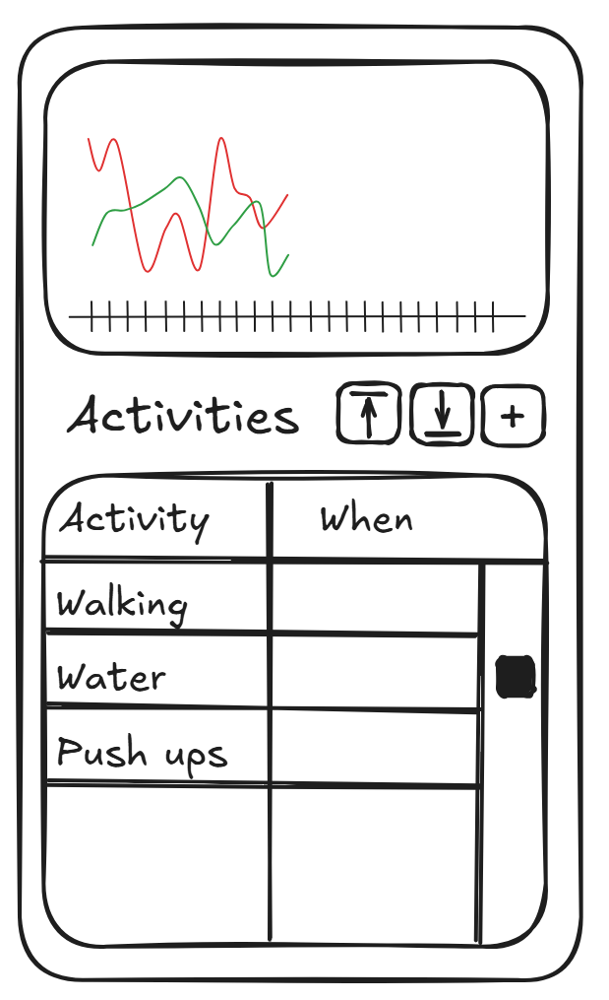
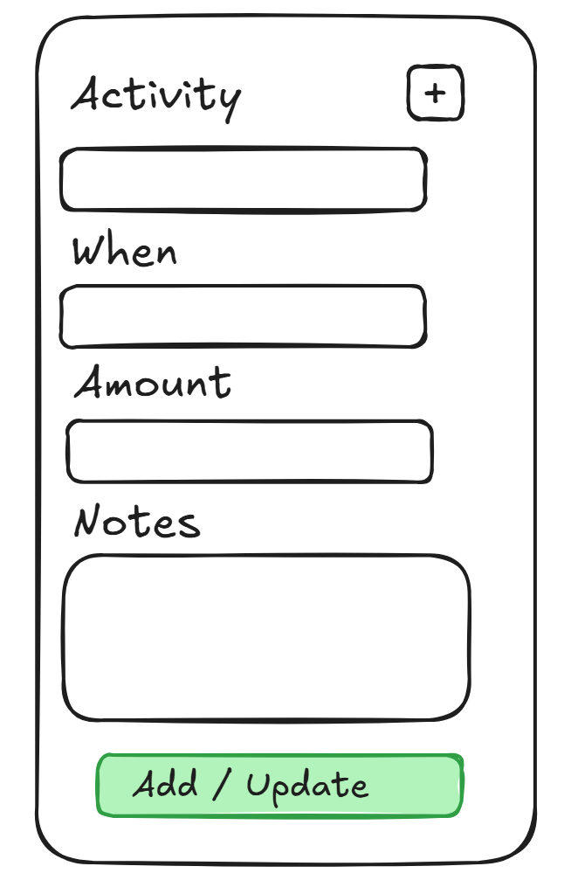
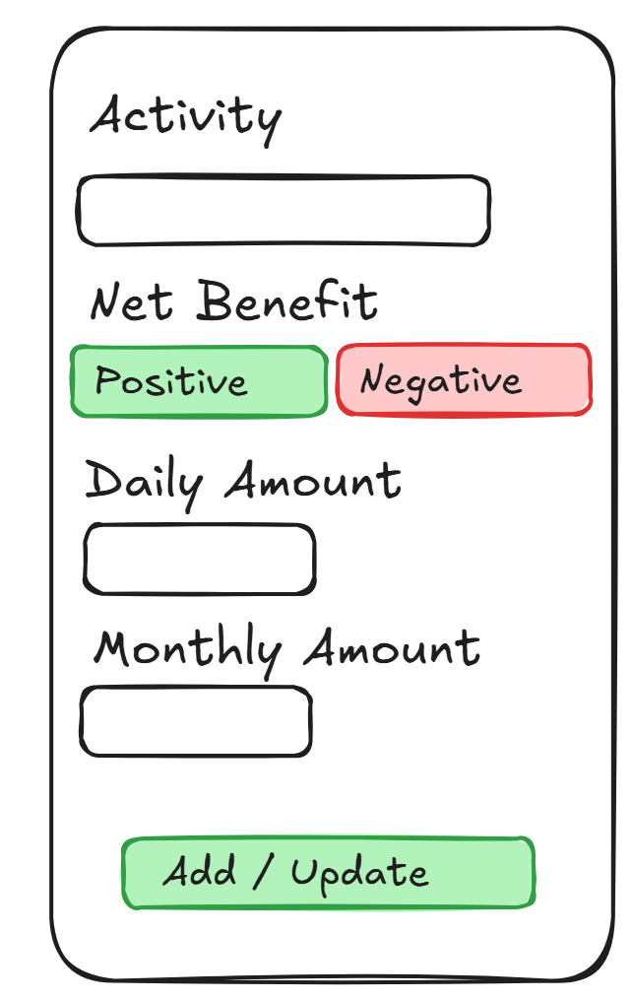

# trainer

A .NET blazor progressive web app that can track all your health related activities including
1. water consumed
1. snacks eaten
1. activites participated in

All data is stored locally in the browser but can be easily exported and imported.

The progressive web app is installable on modern iOS and Android devices without relying on their respective app stores and can be fully used while offline.

# App Features

1. Progressive Web App
    1. Installable on Android, iOS, Windows, and other OSes that support installable progressive web apps.
    1. Fully functional while offline.
    1. Utilizies browser storage
1. Implemented in .NET 10 and targets web assembly output
1. Code should be greater than 90% unit tested
1. Includes github actions that can run the unit tests on pull requests
1. includes a github action that can build and deploy releases to the github action page.

# Basic UI

## Main Screen

Includes a graph of the number of activities by activity type.

Has three buttons including:
1. Import Activities
1. Export Activities
1. Add new Activity, which opens the [Adding / Editing Activity Entries](#adding--editing-activity-entries) screen and add a new activity.

In the Grid of activities, clicking on a row will open that activity in the [Adding / Editing Activity Entries](#adding--editing-activity-entries) screen and allow for updating.

## Adding / Editing Activity Entries

The Activity input is a dropdown of defined activity types.

Clicking on the + button will open the [Adding / Editing Activity Types](#adding--editing-activity-types) screen.

The when field is a datetime picker and if not set defaults to the current local time.

The Amount field accepts whole numbers.

The Notes field is a multiline text field.

Clicking the Add or Update button saves changes and returns to the main screen.

## Adding / Editing Activity Types

The Net Benefit buttons are toggleable can either the green positive or red negative option can be selected (or neither can be selected).

The Daily amount and Weekly Amounts allow for whole numbers.

Clicking the Add or Update button saves changes and returns to the activity screen.