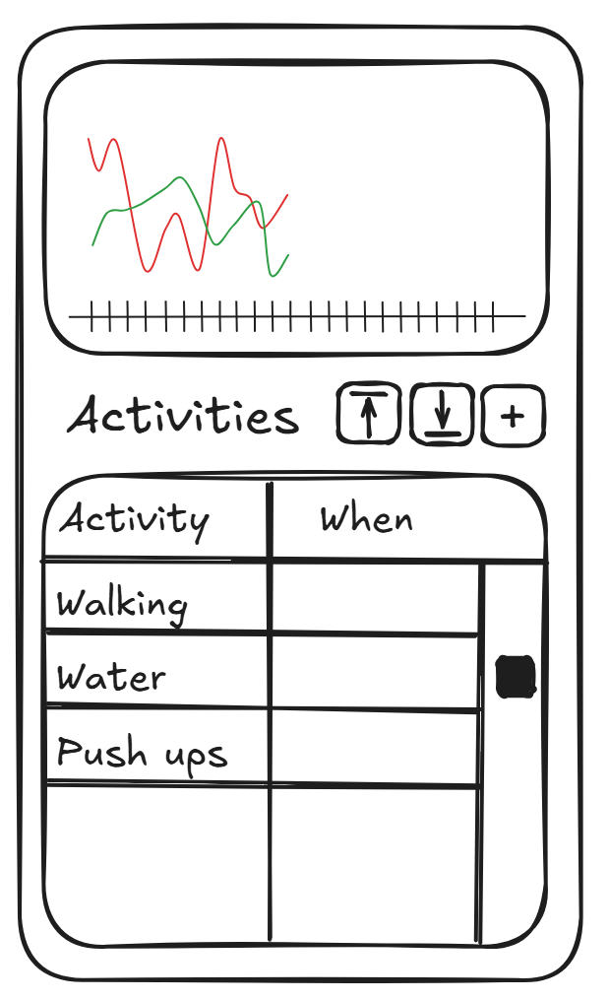
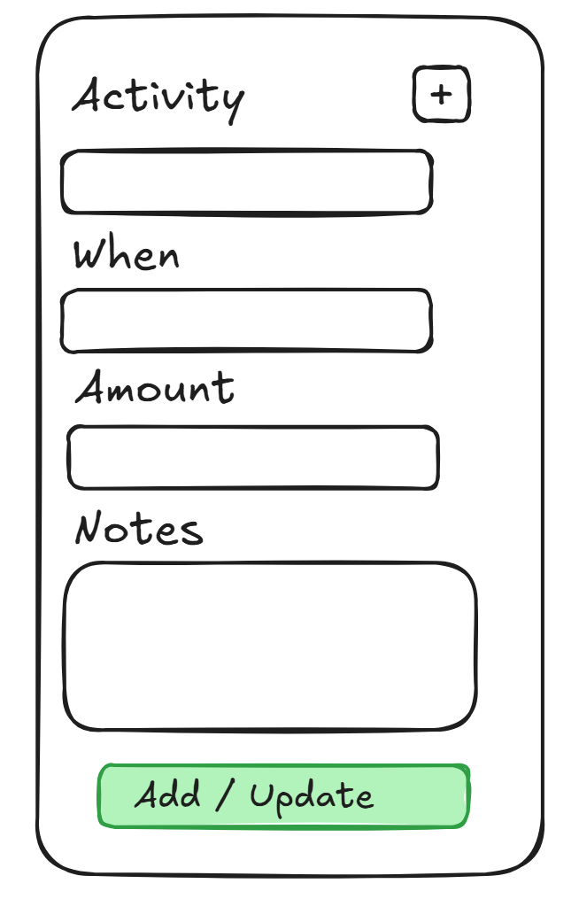
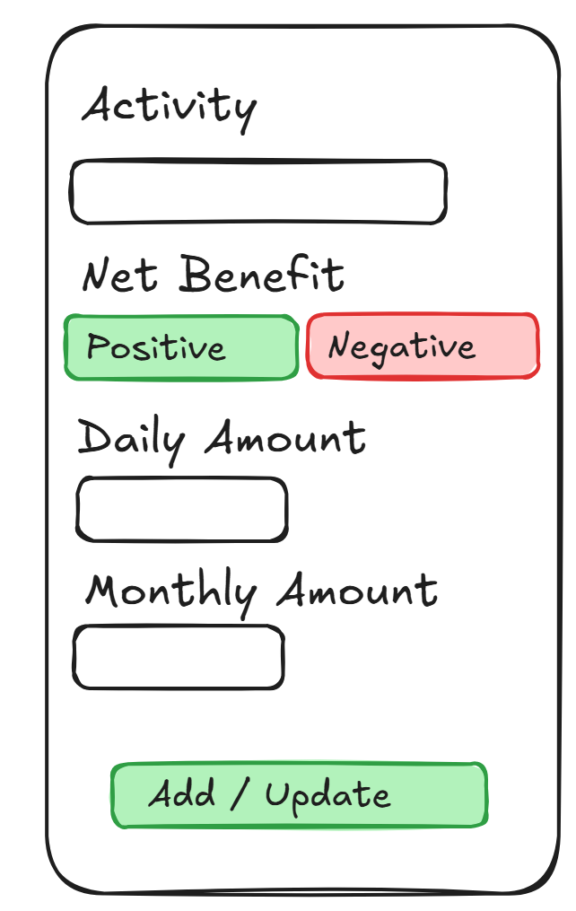

# trainer

A Rust and WebAssembly progressive web app that can track all your health related activities including
1. water consumed
1. snacks eaten
1. activites participated in

All data is stored locally in the browser but can be easily exported and imported.

The progressive web app is installable on modern iOS and Android devices without relying on their respective app stores and can be fully used while offline.

# App Features

1. Progressive Web App
    1. Installable on Android, iOS, Windows, and other OSes that support installable progressive web apps.
    1. Fully functional while offline.
    1. Utilizies browser storage
1. Implemented in Rust, compiled to WebAssembly, with [Dioxus](https://dioxuslabs.com/) for the UI
1. Two test tiers: the domain runs natively, the browser layer runs in headless Chrome
1. Includes github actions that can run the unit tests on pull requests
1. includes a github action that can build and deploy releases to the github action page.

Originally written in C# with Blazor WebAssembly and ported to Rust. Stored data
and export files are byte-compatible with the C# version, so an existing install
keeps its history across the update.

# Basic UI

## Main Screen


Includes a graph of the number of activities by activity type.

Has three buttons including:
1. Import Activities
1. Export Activities
1. Add new Activity, which opens the [Adding / Editing Activity Entries](#adding--editing-activity-entries) screen and add a new activity.

In the Grid of activities, clicking on a row will open that activity in the [Adding / Editing Activity Entries](#adding--editing-activity-entries) screen and allow for updating.

## Adding / Editing Activity Entries


The Activity input is a dropdown of defined activity types.

Clicking on the + button will open the [Adding / Editing Activity Types](#adding--editing-activity-types) screen.

The when field is a datetime picker and if not set defaults to the current local time.

The Amount field accepts whole numbers, or fixed-point decimals when the activity
type is configured for them — digits shift in from the right, so the decimal point
never has to be typed.

The Notes field is a multiline text field.

Clicking the Add or Update button saves changes and returns to the main screen.

## Adding / Editing Activity Types


The Net Benefit buttons are a three-way choice: green positive, grey neutral, or
red negative. Neutral is the default and is excluded from the goal chart.

The Daily and Weekly Amounts use the same entry field as Amount, at the precision
configured for the type.

Clicking the Add or Update button saves changes and returns to the activity screen.

# Development

Requires a Rust toolchain with the `wasm32-unknown-unknown` target and the
[Dioxus CLI](https://dioxuslabs.com/learn/0.7/CLI/installation):

```
rustup target add wasm32-unknown-unknown
cargo install dioxus-cli --locked
```

Run the app, which serves it under `/trainer/` to match the deployed base path:

```
cd trainer-rs/trainer-web && dx serve --platform web
```

## Tests

The domain lives in `trainer-core` and has no browser dependencies, so it tests
natively and fast:

```
cd trainer-rs && cargo test -p trainer-core
```

The browser layer lives in `trainer-web` and tests under `wasm-bindgen-test` in
headless Chrome, which needs `chromedriver` on `PATH` and a `wasm-bindgen-cli`
matching the `wasm-bindgen` version in `Cargo.lock`:

```
cd trainer-rs && cargo test --target wasm32-unknown-unknown -p trainer-web
```

The split is deliberate: keeping the domain free of browser dependencies is
enforced by the crate boundary rather than by review.

`trainer-rs/tests/fixtures/` holds golden files captured from the original C#
implementation. They are de-identified from a real profile, they are what the
port is checked against, and CI fails if a test run modifies one.

## GitNexus MCP Server

This project is indexed by [GitNexus](https://www.npmjs.com/package/gitnexus) for code intelligence. Start the GitNexus MCP server with:

```
npx -y gitnexus@latest mcp
```

Start the GitNexus web server UI with:

```
npx gitnexus@latest serve
```